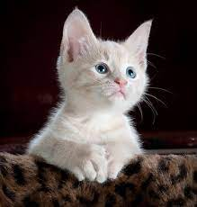
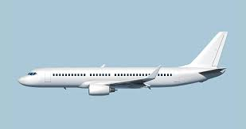

# IdentifyMe

IdentifyMe is a basic object detector web app. Image can be uploaded to the app then the object present in image can be predicted.

## Training
The model has been trained on CIFAR-10 dataset. Model used is ResidualResnet Network. The model has an accuracy of 92 percent.
The model classifies images into one of the following classes - Plane, Car, Bird, Cat, Deer, Dog, Frog, Horse, Ship, Truck

## Deployment
The model is deployed on heroku using a Flask app.

## Result

|                            Input Image                             |           Prediction           |
| :----------------------------------------------------------------: | :----------------------------: |
|  | Is it a Cat? |
|  | Is it a plane? |

## Group Members
- Vishwajeet Pratap Singh (vishwajeet.pratapsingh2207@gmail.com)
- Happy Singh (hsingh0805@gmail.com)